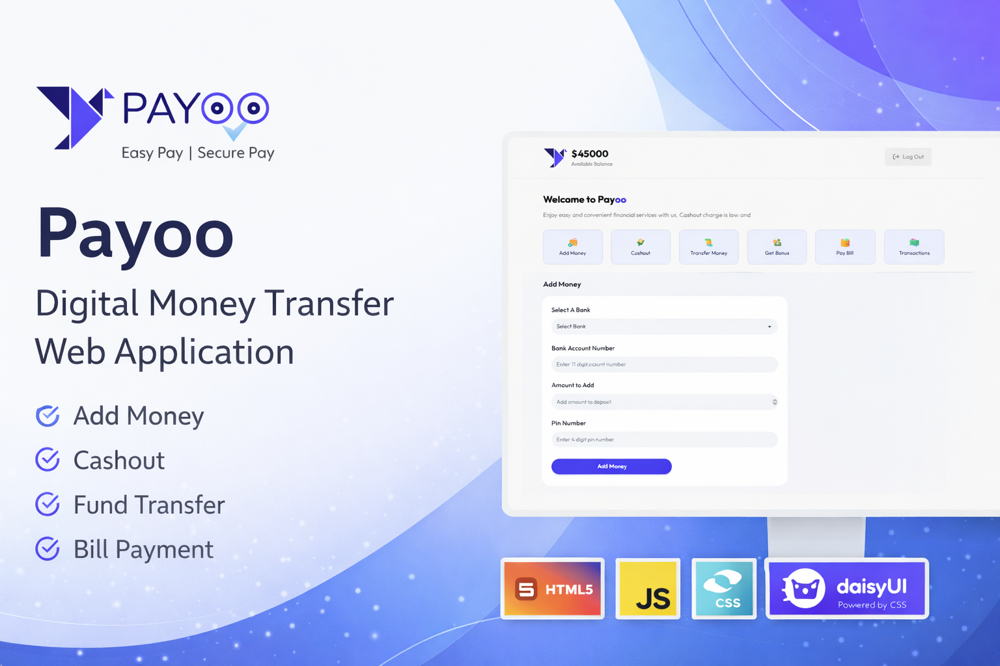

  

<h1 align="center">💳 Payoo — Digital Money Transfer Web Application</h1>

---

## 📌 Project Overview

**Payoo** is a digital financial service web application designed to simulate secure money transactions through an interactive user interface.

The application replicates real-world fintech workflows within a unified dashboard system, allowing users to perform essential financial operations in a structured and responsive environment.

---

## 🔗 Live Demo

👉 https://rzoshin.github.io/Payoo-Money-Transfer-App/

---

## ✨ Key Features

- 🔐 Client-side login authentication
- 💰 Add Money functionality
- 💸 Cashout system
- 🔄 Transfer Money between accounts
- 🎁 Bonus collection module
- 🧾 Bill payment system
- 📊 Transaction tracking dashboard
- 📱 Fully responsive layout

---

## 🛠 Technologies Used

- **Vanilla JavaScript**
- **HTML5**
- **CSS3**
- **Tailwind CSS**
- **DaisyUI**
- Responsive Web Design Principles
- DOM Manipulation & Event Handling

---

## 🧠 Core Implementation Concepts

- Client-side form validation
- Login redirection to dashboard page
- Dynamic account balance updates
- Interactive service action cards
- Event-driven financial operations
- State-based UI updates

---

## 🎯 Purpose of the Project

This project was developed to:

- Practice real-world fintech UI simulation
- Strengthen JavaScript DOM manipulation skills
- Implement client-side authentication flow
- Build interactive dashboards using Tailwind & DaisyUI
- Improve front-end system structuring

---

## 🚀 Future Improvements

- Backend authentication integration
- Database-based transaction storage
- Improved security validation
- API-based financial data simulation
- Enhanced UI animations

---

## 👨‍💻 Author

**Raiyan Zannat**  
CSE Graduate | MSc Engineering Candidate |
Focused on AI, Front-End Systems & Intelligent Applications
